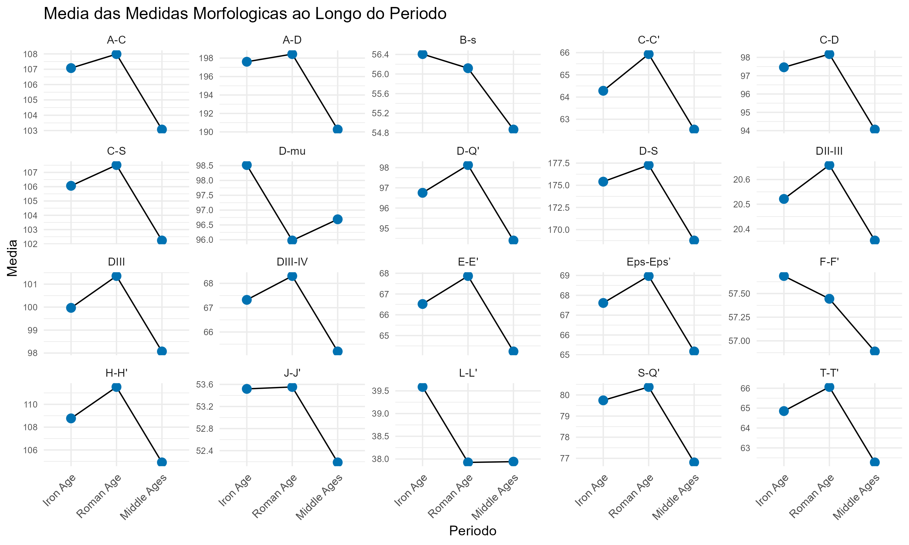
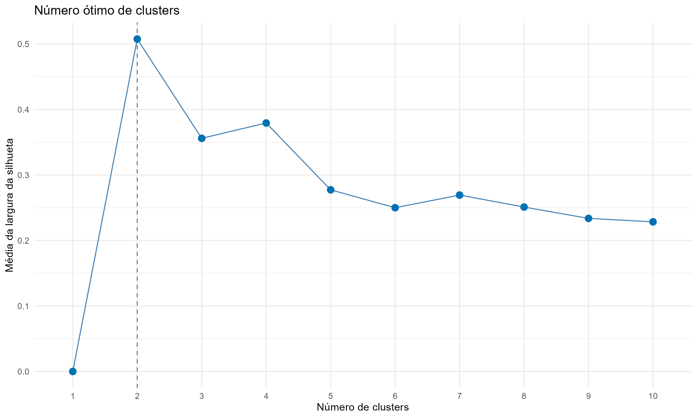
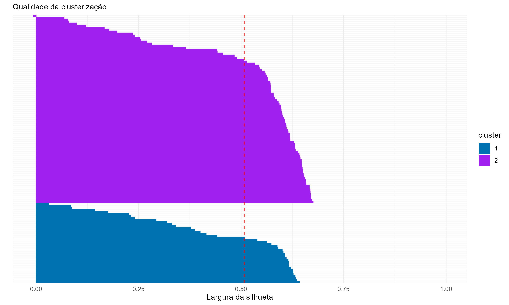
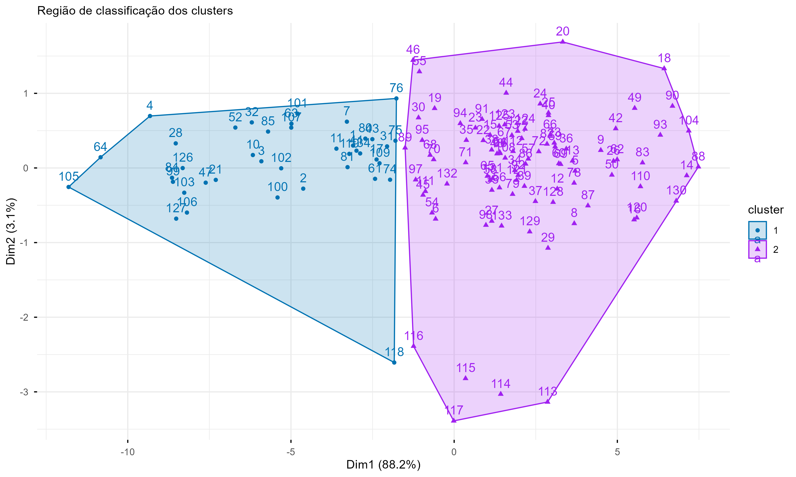
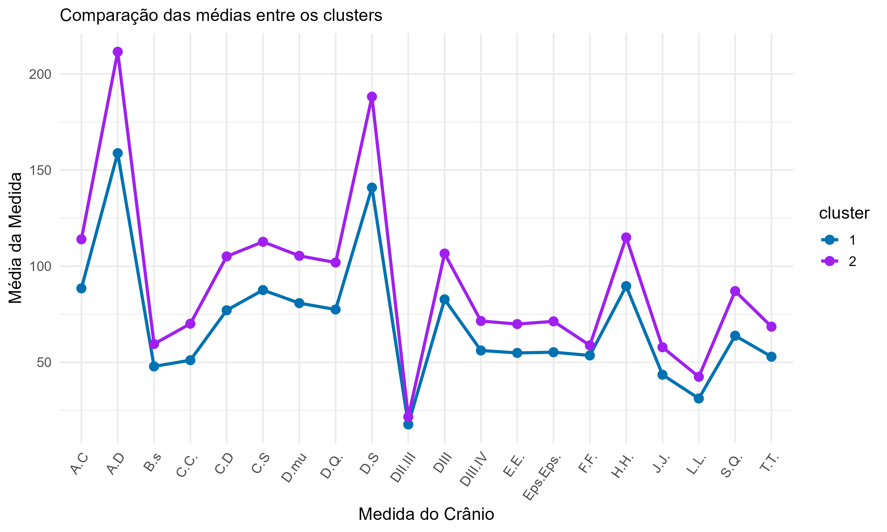
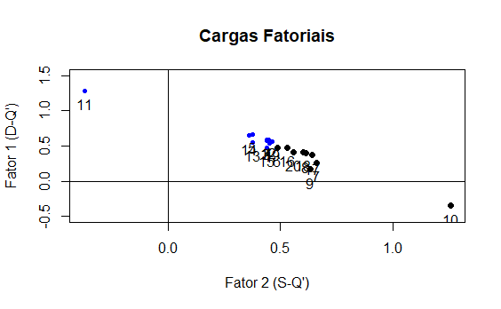
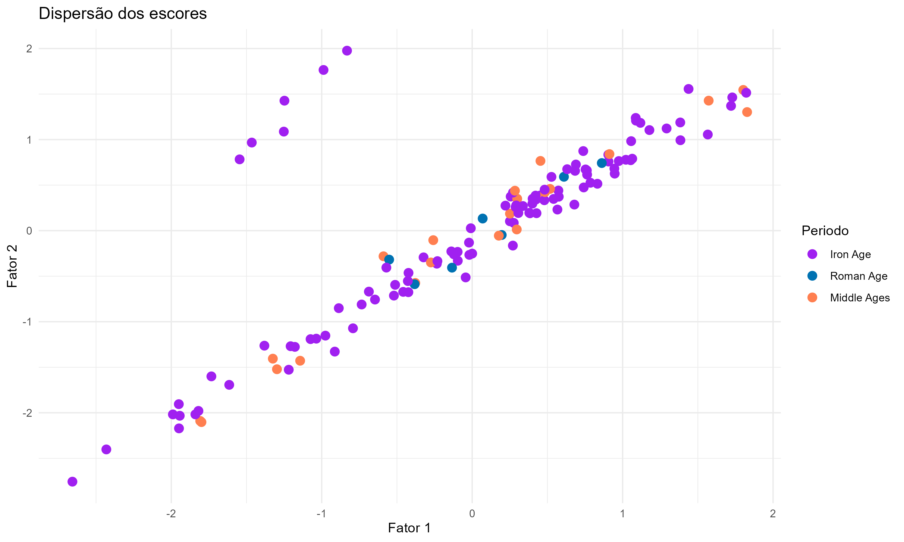

## Resumo

Este estudo tem como objetivo a análise dos dados do arqueólogo Prof° Albert Egges van Giffen, coletados e documentados no início do século XX. A pergunta central consistiu na tentativa de associação entre as mudanças morfológicas de 488 crânios de cães encontrados no norte da Holanda, e o período em que esses locais possuiam civilizações em atividade. E, com isso, analisar a relação entre os dados métricos e a domesticação dos animais; alguns crânios de lobos também constam em meio aos dados.

Para isso, foram usadas técnicas de Análise Multivariada (Clusterização, Análise de Componentes Principais e Análise Fatorial) e o método ANOVA para análise de variância. A Clusterização permitiu o agrupamento de cães com medidas distintas de crânios: um grupo de cães com crânios maiores, e o outro com crânios menores. Apesar do sucesso no agrupamento, não foi possível afirmar, sem mais informações, se o grupo com crânios maiores correspondia a lobos e cães selvagens, e se o grupo com crânios menores correspodia a cães domesticados (mais recentes).

Em segunda instância, a Análise Fatorial em conjunto com a Análise de Componentes Principais permitiu a redução da dimensionalidade dos dados, fazendo com que uma parte expressiva da sua variabilidade fosse explicada por apenas dois fatores; as medidas `D-Q'` e `S-Q'`. 

Ainda, a ANOVA foi utilizada para testar se a média dos crânios nos diferentes períodos era significativa a nível $\alpha = 0,05$, considerando os dados no novo espaço de dimensão reduzida. A partir dos resultados, foi possível confirmar que o período não impacta no tamanho dos crânios de forma evidente, provavelmente pelo fato de a informação estar relacionada aos locais, e não diretamente aos ossos.

## Introdução

As seguintes análises foram feitas com base nos dados do arqueólogo Prof° Albert Egges van Giffen, coletados e documentados no início do século XX. Os 488 crânios encontrados no norte da Holanda correspondem à cães que viveram entre o início da Idade do Ferro (800 a.C.) e a Era Moderna (1950 d.C.), sem confirmação se eram domesticados ou selvagens; alguns crânios de lobos também constam em meio aos dados. Por fim, as informações coletadas abrangem dados métricos a respeito dos crânios, bem como índices de identificação, nomes e coordenadas dos locais nos quais foram encontrados, entre outras noções.

O objetivo deste estudo é avaliar mudanças morfológicas no crânio dos animais ao longo dos anos, considerando também a associação dessas alterações com a domesticação dos cães. Para cumprir o propósito, foram empregadas técnicas de Análise Multivariada, que serão exibidas em seções seguintes. Em adendo, serão discutidas as limitações causadas pelos dados coletados e as decisões para lidar com as mesmas.

## Metodologia

Nesta seção, serão discutidas as técnicas estatísticas, em sua maioria de Análise Multivariada, empregadas para responder à pergunta central do estudo.

```{r, include=FALSE}
library(tidyverse)
library(readxl)
library(psych)
library(factoextra)
library(cluster) 
```

```{r, include=FALSE}
giffen <- read_excel("C:/Users/nicol/Desktop/unicamp/TF ME731/Van Giffen Measurement Data.xlsx", sheet = "vGdata")
```

```{r, include=FALSE}
data <- giffen %>% select(-c(`Van Giffen ID_1`, `Van Giffen ID_2`, BAI_ID, RMO_ID, Other_ID, `Alternate spelling`, `Object location`, Comments, `Year collected`, Longitude, Latitude, `Plis sourc`, `Erster Hypoc`, `SS stud`, PM4, `Start Range`, `End Range`, ba, `A-S (S')`))
```

### Manipulação do conjunto de dados

Em primeira instância, as variáveis presentes no conjunto de dados foram análisadas quanto a sua relevância para responder ao objetivo do estudo. Assim, as colunas `Van Giffen ID_2`, `BAI_ID`, `RMO_ID`, `Other_ID` e `Van Giffen ID_2` foram removidas; para questões de identificação, apenas `ID` foi mantida. `Start Range` e `End Range` foram removidas porque as legendas sobre o intervalo das épocas foram disponibilizados em um documento separado, não havendo necessidade de mantê-las no conjunto.

Com relação às localizações, a coluna `Alternate spelling` foi removida porque `Site location` não possuia dados faltantes e, portanto, fornecia informações suficientes sobre os locais. `Object location` também foi excluída pois não acrescentava dados para responder ao objetivo do estudo. O mesmo foi determinado para as colunas `Comments` e `Year collected`. Ainda, as informações referentes à latitude e longitude também foram retiradas (colunas `Latitude` e `Longitude`), uma vez que não complementavam de maneira expressiva as informações de `Site location`.

Para mais informações sobre as medidas dos crânios, foi acessado o repositório oficial do estudo (@scheele2017dogs). A partir da análise dos documentos, não foram encontradas descrições claras sobre o significado das variáveis `Plis sourc`, `Erster Hypoc`, `SS stud` e `PM4`, resultando na exclusão das mesmas. A coluna `ba`, que correponde ao comprimento da extremidade anterior da sutura mandibular até o processo condilar, também foi retirada do conjunto por apresentar muitos dados faltantes; as outras medidas presentes foram consideradas suficientes. Por fim, `A-A (S')` também foi excluída da análise, pois não foram encontrados registros que explicassem a que se referiam os números entre parênteses e qual seria a medida correta a ser considerada.

Em seguida, foi levado em conta o tratamento de dados faltantes. Uma vez que o período histórico ao qual os ossos pertenciam eram relevantes para responder à pergunta central, foi considerada a remoção das observações que não possuíam nenhuma informação sobre o fator época. Entretanto, isso resultaria na perda de 179 dados; logo, foi decidido substituir os dados faltantes pela moda das respectivas colunas. Assim, restavam observações faltantes apenas nos dados referentes às medidas dos crânios.

```{r, include=FALSE}
moda_start <- names(sort(table(data$`Start Period`), decreasing = TRUE)[1])
data$`Start Period`[is.na(data$`Start Period`)] <- moda_start

moda_end <- names(sort(table(data$`End Period`), decreasing = TRUE)[1])
data$`End Period`[is.na(data$`End Period`)] <- moda_end
```

Foram feitas duas tentativas de análise: com e sem imputação de dados; a última trouxe resultados melhores e, portanto, está descrita neste estudo, enquanto a primeira pode ser consultada no repositório em que os códigos foram divulgados. Após desconsiderar todos os dados faltantes, o conjunto obtido continha 134 observações. A quantidade de dados foi reduzida de forma visível, escolha que impactou nos resultados, apesar de ainda assim ter sido preferida à imputação de dados após a comparação de resultados.

```{r, include=FALSE}
data2 <- data %>% drop_na()
```

Por fim, foram tomadas decisões acerca do agrupamento dos períodos. Épocas menores foram englobadas nas maiores, sendo consideradas apenas Idade do Ferro, Idade Romana, Período Medieval e Era Moderna. Esses agrupamentos foram realizados nas colunas `Start Period` e `End Period`, e cada grupo ficou com as quantidades de observações exibidas na Tabela 1.

```{r, include=FALSE}
data$`Start Period` <- data$`Start Period` %>%
  fct_collapse(
    "Iron Age" = c(
      "Early Iron Age",
      "Middle Iron Age",
      "Late Iron Age",
      "Iron Age"),
    
    "Roman Age" = c(
      "Roman Age",
      "Middle Roman Age"),
    
    "Middle Ages" = c(
      "Middle Ages", 
      "Early Middle Ages B",
      "Early Middle Ages D"),
    
    other_level = NULL )

ordem_final_start <- c(
  "Iron Age", 
  "Roman Age", 
  "Middle Ages")

data$`Start Period` <- data$`Start Period` %>%
  fct_relevel(ordem_final_start)
```

```{r, include=FALSE}
niveis_para_agrupar_medios <- c(
  "Early Middle Ages D",
  "Middle Ages",
  "Late Middle Ages B",
  "Late Middle Ages A",
  "Late Middle Ages")

data$`End Period`<- data$`End Period` %>%
  fct_collapse(
    "Middle Ages" = niveis_para_agrupar_medios,
    other_level = NULL )

ordem_final_end <- c(
  "Roman Age",
  "Middle Ages",
  "Modern Era")

data$`End Period` <- data$`End Period` %>%
  fct_relevel(ordem_final_end)
```

```{r, include=FALSE}
data %>% group_by(`Start Period`) %>% summarise(Quantidade = n ())

data %>% group_by(`End Period`) %>% summarise(Quantidade = n ())
```

```{r, echo=FALSE}
df_combinado <- data.frame(
  `Start.Period` = c("Idade do Ferro", "Idade Romana", "Período Medieval"),
  `Quantidade...2` = c(371, 39, 78),
  `End.Period` = c("Idade Romana", "Período Medieval", "Era Moderna"),
  `Quantidade...4` = c(1, 396, 91)
)
colnames(df_combinado) <- c("Start Period", "Quantidade", "End Period", "Quantidade")
```

: Quantidade de observações por período em cada variável.

| Start Period     | Quantidade | End Period       | Quantidade |
|:-----------------|:----------:|:-----------------|:----------:|
| Idade do Ferro   |    371     | Idade Romana     |     1      |
| Idade Romana     |     39     | Período Medieval |    396     |
| Período Medieval |     78     | Era Moderna      |     91     |

Pelo fato da variável `Start Period` apresentar grupos com quantidades de observações mais equilibradas que `End Period`, esta também foi removida da análise. Logo, `Start Period` foi usada como referência temporal para responder ao objetivo.

```{r, include=FALSE}
data <- data %>% select(-c(`End Period`))
```

### Clusterização com PAM

A clusterização é uma técnica de análise de agrupamento que visa identificar grupos de indivíduos com características semelhantes, e pode ser utilizada com algoritmos iterativos distintos. Escolheu-se o algoritmo PAM (Particionamento em Torno de Medoides), que usa uma técnica de clusterização particional, selecionando amostras distintas como os primeiros (e melhores) representantes de cada cluster. Essas amostras são chamadas de medoides, e correspondem ao centro de cada grupo.

A partir da primeira divisão de indivíduos, as seguintes ocorrem baseadas em distância — a euclidiana é a usada por padrão, inclusive neste estudo, mas o algoritmo também suporta outras métricas. Essas separações têm como objetivo minimizar a variação dentro de cada cluster, e o algoritmo PAM tem a vantagem de ser robusto a observações discrepantes (outliers). Isso evita que um erro de medição distorça o centro do cluster e, consequentemente, classifique de maneira equivocada as próximas observações.

Para mais detalhes sobre outros algoritmos usados em clusterizações, como o K-means e o Hierárquico, ver @Everitt2011.

### Análise de Componentes Principais (PCA)

O objetivo da PCA é identificar as dimensões de maior variabilidade nos dados, e geralmente é utilizada para tomar decisões acerca da quantidade de componentes a ser incluída na Análise Fatorial.

Primeiramente, são calculados os Componentes Principais para descobrir quais variáveis mais contribuem para cada componente, que correspondem às novas dimensões dos dados. Esses componentes são não correlacionados entre si, e seus escores representam as novas coordenadas dos crânios nesse espaço de dimensão reduzida. Portanto, os escores são utilizados para analisar a separação ou agrupamento dos crânios a partir das principais variáveis que os diferenciam.

Para a seleção de componentes relevantes para a análise, foi utilizado o Scree Plot (ou Gráfico do Cotovelo) em conjunto com o Critério de Kaiser, abordados em @Hair2010. Em particular, o Critério de Kaiser sugere a seleção de um componente apenas se ele explicar uma maior parte da variabilidade dos dados do que uma única variável faria sozinha. Essa retenção é feita para todos os componentes de autovalor maior que $1$, uma vez que os autovalores representam a quantidade da variabilidade total que cada componente principal explica.

### Análise Fatorial

A análise fatorial tem como objetivo identificar dimensões latentes subjacentes às medidas dos crânios dos animais. Este procedimento permite reduzir a complexidade dos dados, sintetizando múltiplas variáveis correlacionadas em fatores que representam padrões de comportamento mais gerais. Uma discussão mais aprofundada sobre o método também encontra-se em @Hair2010. Após a extração dos fatores, são calculados os escores fatoriais para cada observação, que representam a posição relativa de cada crânio em relação aos fatores identificados.

Para realizar a Análise Fatorial, foram utilizadas funções do pacote `psych`. Essas funções e seus argumentos serão detalhados a seguir por envolverem certo grau de arbitrariedade em suas configurações, portanto as escolhas feitas serão justificadas. A função `psych::fa` foi utilizada para a realização da análise, e o argumento de entrada corresponde às medidas dos crânios dos animais. O segundo argumento corresponde a quantos componentes devem ser extraídos na análise.

A primeira escolha de fato foi feita com relação ao tipo de rotação: a rotação oblíqua, indicada no argumento pelo valor `promax`, permite com que os fatores extraídos sejam correlacionados entre si. Essa descisão foi tomada na tentativa de adaptar as dimensões subjacentes à realidade dos dados, uma vez que, sendo medidas do mesmo crânio, as variáveis naturalmente apresentam certo grau de correlação. Isso não é considerado na PCA, que trata as dimensões como se fossem estritamente ortogonais.

A segunda escolha foi feita com relação ao método de fatoração: a Máxima Verossimilhança é um método de estimação que tenta encontrar parâmetros que maximizem a probabilidade de observar os dados, assumindo que as variáveis seguem uma distribuição normal multivariada. No contexto do estudo e da disciplina, foi considerado o método mais apropriado. Por fim, os escores fatoriais foram calculados a partir de um método de regressão para auxiliar na inserção da análise do período em conjunto com as mudanças morfológicas nos crânios.

### Análise de Variância (ANOVA)

Para testar o impacto da mudança de período nas dimensões morfológicas latentes, encontradas pelos métodos descritos anteriormente, foi empregada a Análise de Variância (ANOVA). Essa técnica permite determinar se as médias de grupos distintos diferem a um nível de significância arbitrário, aqui adotado $\alpha = 0,05$. 

Essa distinção se dá a partir da decomposição da variância total dos dados em dois componentes: a variância entre grupos e a variância dentro dos grupos; a primeira é atribuida ao efeito dos fatores do modelo, e a segunda, ao erro aleatório. Enfim, a significância é avaliada por meio da Estatística F, que compara a magnitude da primeira variância com o erro inerente ao sistema. Um p-valor inferior a $\alpha$ fornece evidência suficiente para rejeitar a hipótese nula determinada em favor da hipótese alternativa.

## Resultados

Na seguinte seção, serão exibidos e discutidos os resultados encontrados após a aplicação da metodologia descrita.

### Análise Exploratória

Inicialmente, para analisar as mudanças nas medidas dos crânio ao longo dos períodos, calculou-se a média de cada medida em cada período. Essas diferenças podem ser conferidas na Tabela 2 de forma numérica, e na Figura 1, de forma visual. Na Tabela 2, é possível notar pequenas variações nas médias das medidas entre as épocas, o que é confirmado na Figura 1. Entretanto, é importante ressaltar que a escala dessas alterações é pequena; ainda assim, as medidas diminuem com o passar dos anos, exceto `D-mu`.

```{r, include=FALSE}
data_medias <- data %>% select(-c(ID, `Site location`, `Skeletal part`)) %>%  group_by(`Start Period`) %>% summarise_all(mean, na.rm = TRUE)

summary(data %>% select(-c(ID, `Site location`, `Skeletal part`, `Start Period`)))
```

: Médias das medidas de acordo com o período.

| Medida       | Idade do Ferro | Idade Romana | Período Medieval |
|:-------------|:--------------:|:------------:|:----------------:|
| **C-C'**     |     64.29      |    65.96     |      62.56       |
| **C-D**      |     37.45      |    38.17     |      34.06       |
| **A-C**      |     107.88     |    107.59    |      108.04      |
| **A-D**      |     197.23     |    198.43    |      192.25      |
| **D-mu**     |     95.52      |    95.98     |      96.70       |
| **I-J**      |     39.59      |    37.93     |      37.94       |
| **I-L**      |     53.52      |    53.54     |      52.19       |
| **H-H'**     |     108.77     |    111.52    |      104.91      |
| **F-F'**     |     57.67      |    57.44     |      56.89       |
| **F-G**      |     73.74      |    80.38     |      75.81       |
| **D-Q**      |     56.76      |    58.13     |      54.96       |
| **O-S**      |     175.41     |    177.28    |      168.77      |
| **DW**       |     99.97      |    101.36    |      98.07       |
| **DM-W**     |     67.32      |    68.30     |      65.20       |
| **DN-W**     |     20.52      |    20.65     |      20.55       |
| **T-T'**     |     64.85      |    66.07     |      62.27       |
| **E-E'**     |     66.52      |    67.37     |      64.23       |
| **Eps-Eps'** |     67.61      |    69.73     |      65.72       |
| **C-S**      |     106.88     |    107.51    |      102.23      |
| **B-S**      |     56.45      |    56.11     |      54.09       |

```{r, include=FALSE}
data_longo <- data_medias %>%
  pivot_longer(
    cols = -`Start Period`,   
    names_to = "Variavel",
    values_to = "Media") %>%
  filter(!is.na(Media))

grafico_final <- data_longo %>%
  ggplot(aes(x = `Start Period`, y = Media, group = 1)) +
  geom_line(color = "black") +
  geom_point(color = "#0072B2", size = 3) +
  facet_wrap(~ Variavel, scales = "free_y") +
  labs(
    title = "Media das Medidas Morfologicas ao Longo do Periodo",
    x = "Periodo",
    y = "Media"
  ) +
  theme_minimal() +
  theme(
    axis.text.x = element_text(angle = 45, hjust = 1),
    axis.text.y = element_text(size = 7))

ggsave(
  filename = "figura_1.png",
  plot = grafico_final,
  device = "png", 
  width = 10,     
  height = 6,     
  dpi = 300)
```



Na tentativa de obter uma relação mais expressiva entre as mudanças mofológicas dos crânios e os períodos, foi feito um agrupamento por local (coluna `Site location`). A ideia era procurar algum padrão em alguma das civilizações que pudesse solidificar a relação entre domesticação e tamanho de crânio. Entretanto, a tentativa não acrescentou resultados à análise e foi descartada, podendo ser verificada nos códigos presentes no repositório.

### Clusterização

Com o objetivo de reduzir a dimensionalidade dos dados, foi feita uma clusterização com o algoritmo PAM (Particionamento em Torno de Medoides). Primeiro, para escolher a quantidade de clusters ideal para a análise, foi usado o Método da Silhueta; quanto maior a média da largura da silhueta, mais bem ajustados aos dados estão as divisões dos clusters. Como é possível ver na Figura 2, o número de clusters que maximiza a média da largura é $K = 2$ e, portanto, a análise foi continuada com tentativa de separação dos crânios em dois grupos de acordo com suas medidas.

```{r, echo=FALSE, warning=FALSE}
data2 <- data %>% drop_na()
medidas <- data2 %>% select(-c(ID, `Site location`, `Start Period`, `Skeletal part`))

df_medidas <- as_tibble(medidas)

dados_cluster_scaled <- scale(df_medidas)
```

```{r, include=FALSE}
k <- fviz_nbclust(dados_cluster_scaled, pam, method = "silhouette") + theme_minimal() + geom_line(color = "black") + geom_point(color = "#0072B2", size = 3) +
  labs(title = "Número ótimo de clusters") +
  xlab("Número de clusters") + 
  ylab("Média da largura da silhueta")

ggsave(
  filename = "figura_2.png",
  plot = k,
  device = "png", 
  width = 10,     
  height = 6,     
  dpi = 300)
```



```{r, include=FALSE}
K_escolhido_pam <- 2 

set.seed(204355)

modelo_pam <- pam(
  x = dados_cluster_scaled, 
  k = K_escolhido_pam,  
  metric = "euclidean",
  cluster.only = FALSE)
```

Para verificar a qualidade da separação das observações, as silhuetas dos clusters foram separadas e analisadas de forma individual na Figura 3. Ao total, $94$ observações foram alocadas para o cluster 2, e $40$ para o cluster 1. A média das silhuetas no primeiro cluster é equivalente a $0,46$, e no segundo, $0,53$ — ou seja, em um índice que varia entre $-1$ e $1$, isso significa que a separação feita pode ser considerada razoável. A linha tracejada vermelha presente no gráfico representa a média simples das médias das silhuetas, equivalente a $0,51$.

Apesar da separação clara, não foi possível afirmar, sem mais informações, se o grupo com crânios maiores correspondia a lobos e cães selvagens, e se o grupo com crânios menores correspodia a cães domesticados (mais recentes).

```{r, include=FALSE}
silhueta <- fviz_silhouette(modelo_pam) +
  labs(
    title = NULL, 
    subtitle = "Qualidade da clusterização",
    fill = "cluster") +
  theme_minimal() +
  theme(
    axis.text.y = element_blank(),
    legend.position = "right") +
  coord_flip() +
  scale_fill_manual(values = c("#0072B2", "purple")) +
  scale_color_manual(values = c("#0072B2", "purple")) +
  guides(color = "none") +
  ylab("Largura da silhueta") 

ggsave(
  filename = "figura_3.png",
  plot = silhueta,
  device = "png", 
  width = 10,     
  height = 6,     
  dpi = 300)
```



```{r, include=FALSE}
cluster <- fviz_cluster(modelo_pam, data = dados_cluster_scaled,
ellipse.type = "convex",
palette = "set1", 
ggtheme = theme_minimal(),
) +
   scale_fill_manual(values = c("#0072B2", "purple")) +
  scale_color_manual(values = c("#0072B2", "purple")) +
  labs(subtitle = "Região de classificação dos clusters",
       title = NULL)

ggsave(
  filename = "figura_4.png",
  plot = cluster,
  device = "png", 
  width = 10,     
  height = 6,     
  dpi = 300)
```



Em adendo, o gráfico da Figura 4 permitiu a visualização da região de classificação de cada cluster, ficando evidente que há, de fato, grupos diferentes caracterizados por diferentes tamanhos de crânio. Por fim, para caracterizar cada grupo com relação às medidas, calculou-se as médias das medidas entre os indivíduos de cada cluster. A comparação entre as medidas médias dos grupos pode ser analisada na Figura 4, na qual fica evidente que o cluster 2 correponde a cães de crânios maiores, e o cluster 1, a cães de crânios menores. Em complemento à figura, a Tabela 3 traz as médias das medidas de acordo com o cluster ao qual os indivíduos pertencem. Agora, em comparação à Tabela 2, a diferença entre as médias das medidas se torna mais clara e expressiva em escala por conta da clusterização e da ausência de separação por período.

```{r, include=FALSE}
df_medidas$Cluster_PAM <- modelo_pam$clustering

medias_pam <- df_medidas %>%
group_by(Cluster_PAM) %>%
summarise(across(everything(), mean, na.rm = TRUE))

medias_pam
```

: Médias das medidas de acordo com o cluster.

| Medida       | Cluster 1 | Cluster 2 |
|:-------------|:---------:|:---------:|
| **C-C'**     | 51.60000  | 70.89574  |
| **C-D**      |  77.0750  | 105.1117  |
| **A-C**      |  88.4875  | 114.0053  |
| **A-D**      | 158.8250  | 211.5559  |
| **D-mu**     |  80.7925  | 105.4096  |
| **L-L'**     | 31.20000  | 42.45377  |
| **J-J'**     | 43.52250  | 57.84093  |
| **H-H'**     |  89.9250  | 114.9628  |
| **F-F'**     | 53.37500  | 58.92447  |
| **S-Q'**     |  63.6500  | 87.06383  |
| **D-Q'**     |  77.4750  | 101.9309  |
| **D-S**      | 149.9125  | 188.2021  |
| **DIII-IV**  |  82.3700  | 105.5904  |
| **DII-III**  | 56.16250  | 71.92021  |
| **T-T'**     | 17.67000  | 21.60851  |
| **E-E'**     | 50.92500  | 68.55351  |
| **Eps-Eps'** |  54.6875  |  69.8085  |
| **C-S**      | 55.25000  | 71.31383  |
| **B-S**      | 47.66250  | 59.53191  |

```{r, echo=FALSE}
medias_clusters_pam <- data.frame(medias_pam)

medias_clusters_pam$Cluster_PAM <- as.factor(medias_clusters_pam$Cluster_PAM)

medias_long_pam <- medias_clusters_pam %>%
  pivot_longer(
    cols = -Cluster_PAM,          
    names_to = "Medida",          
    values_to = "Valor_Medio")

comparacao <- ggplot(
  medias_long_pam, 
  aes(x = Medida, y = Valor_Medio, group = Cluster_PAM, color = Cluster_PAM)) +
  geom_line(size = 1.2) +
  geom_point(size = 3) +
  labs(
    title = NULL,
    subtitle = "Comparação das médias entre os clusters",
    x = "Medida do Crânio",
    y = "Média da Medida",
    color = "cluster") +
  theme_minimal(base_size = 14) +
  theme(
    axis.text.x = element_text(angle = 55, hjust = 1) ) +
  scale_color_manual(values = c("#0072B2", "purple"))

ggsave(
  filename = "figura_5.png",
  plot = comparacao,
  device = "png", 
  width = 10,     
  height = 6,     
  dpi = 300)
```



### Análise de Componentes Principais (PCA)

A PCA foi utilizada de maneira prévia à Análise Fatorial para decidir a quantidade de fatores que seria incluídos na próxima etapa. Na Tabela 4, é possível ver que o primeiro componente principal explica $88,16\%$ da variabilidade dos dados, e o segundo, $3,14\%$, totalizando $91,3\%$ de variabilidade explicada em apenas dois componentes.

Como descrito na seção da metodologia, foi utilizado o Critério de Kaiser (corroborado pelo Scree Plot, disponível nos códigos presentes no repositório) para a retenção de componentes na análise. Também é possível ver na Tabela 4 que somente uma dimensão apresentou autovalor maior que $1$, o que indica que quase toda a diferença entre os crânios pode ser resumida em apenas um componente.

```{r, include=FALSE}
medidas <- data2 %>% select(-c(ID, `Site location`, `Start Period`, `Skeletal part`))
```

```{r, include=FALSE}
pca_resultado <- prcomp(medidas, scale. = TRUE)
summary(pca_resultado)
escores_pca <- pca_resultado$x
```

```{r, include=FALSE}
autovalores <- get_eigenvalue(pca_resultado)
fatores_kaiser <- sum(autovalores$eigenvalue > 1) 
autovalores
```

: Autovalores e as porcentagens explicadas da variância para as 10 primeiras dimensões.

| Dimensão | Autovalor | Variância Explicada (%) | Variância Acumulada (%) |
|:--------:|:---------:|:-----------------------:|:-----------------------:|
| Dim. 1| 17.63190| 88.16| 88.16|
| Dim. 2| 0.62816| 3.14 | 91.30|
| Dim. 3| 0.36748| 1.84 | 93.14|
| Dim. 4| 0.28108| 1.41 | 94.54|
| Dim. 5| 0.22527| 1.13 | 95.67|
| Dim. 6| 0.17937| 0.90 | 96.57|
| Dim. 7| 0.13702| 0.69 | 97.25|
| Dim. 8| 0.11669| 0.58 | 97.83|
| Dim. 9| 0.10466| 0.52 | 98.36|
| Dim. 10| 0.08397| 0.42 | 98.78|

Entretanto, como os dois primeiros componentes em conjunto contribuiam para uma parte expressiva da explicação da variabilidade, e os demais componentes acrescentavam à porcentagem da explicação de forma menos significativa — para passar de $95\%$, um avanço considerável a partir de $91,3\%$, seriam necessários mais três componentes —, as duas primeiras dimensões foram julgadas suficientes para serem incluídas na Análise Fatorial.

### Análise Fatorial

Como descrito na metodologia, a função `psych::fa` produziu os resultados que geram a Figura 6, a qual mostra visualmente quais medidas contribuem mais para cada uma dessas duas dimensões. Os pontos representam as medidas dos crânios, e suas coordenadas, as cargas fatoriais relacionadas às medidas; elas indicam o peso de cada variável em relação aos fatores latentes extraídos. É possível observar que a maioria dos pontos estão concentrados no quadrante superior direito, o que significa que essas variáveis possuem cargas positivas em ambos os fatores. Isso faz sentido quando se pensa em termos de medidas de crânios, uma vez que quando um crânio é maior que outro, todas as suas medidas tendem a ser maiores.

Devido ao destaque do ponto $11$, que corresponde à medida `D-Q'`, pode-se afirmar que ela é a que mais caracteriza a primeira dimensão. De modo análogo, o ponto $10$ indica que a medida `S-Q'` caracteriza a segunda dimensão latente dos dados.

```{r, include=FALSE, message=FALSE}
af_resultado_psych <- fa(
  r = medidas,
  nfactors = 2,
  rotate = "promax",
  fm = "ml", 
  scores = "regression")

plot(
  af_resultado_psych,
  ylim = c(-0.5, 1.5),
  xlab = "Fator 2 (S-Q')",
  ylab = "Fator 1 (D-Q')",
  main = "Cargas Fatoriais")
```



Em seguida, a partir dos escores obtidos pela Análise Fatorial, foram realizadas duas ANOVAs (Análises de Variância) para testar a associação entre os dados nesse novo espaço de dimensão reduzida e as mudanças de período. Assim, as hipóteses testadas foram:

-   Hipótese Nula ($H_0$): Não há diferença entre os escores fatoriais entre os diferentes períodos (Iron Age, Roman Age, Middle Ages).
-   Hipótese Alternativa ($H_1$): O período influencia na diferença dos tamanhos dos crânios.

Para o primeiro fator, o p-valor da ANOVA foi equivalente a $0,959$ e, para o segundo, $0,916$. Ou seja, não houve evidência suficiente para rejeitar a hipótese nula para nenhuma das duas dimensões e, portanto, foi possível concluir que os períodos não influenciam na diferença do tamanho dos crânios a um nível de significância $\alpha = 0,05$.

```{r, include=FALSE}
data_analise <- data.frame(medidas)
data_analise$periodo <- data2$`Start Period`
data_analise$scores <- af_resultado_psych$scores

modelo_pc1 <- aov(scores[,"ML1"] ~ periodo, data = data_analise)
modelo_pc2 <- aov(scores[,"ML2"] ~ periodo, data = data_analise)

summary(modelo_pc1)
summary(modelo_pc2)
```

```{r, include=FALSE}
data_scores <- data.frame(
  Fator1 = data_analise$scores[,"ML1"],
  Fator2 = data_analise$scores[,"ML2"],
  Periodo = as.factor(data_analise$periodo)
)


periodo <- ggplot(data_scores, aes(x = Fator1, y = Fator2, color = Periodo)) +
  geom_point(size = 3) +
  labs(
    title = "Dispersão dos escores",
    x = "Fator 1",
    y = "Fator 2",
    color = "Periodo" 
  ) +
  theme(legend.position = c(0.1, 0.9)) + theme_minimal() +
  scale_color_manual(values = c("purple", "#0072B2", "#FF7F50"))

ggsave(
  filename = "figura_7.png",
  plot = periodo,
  device = "png", 
  width = 10,     
  height = 6,     
  dpi = 300)
```

 

Ainda, a Figura 7 permite a interpretação visual dos resultados obtidos pelas ANOVAs. A associação positiva entre os fatores é perceptível pela dispersão dos dados, o que corrobora a escolha da rotação oblíqua por conta da falta de independência entre os fatores.

Com relação à coloração por período, não é possível identificar grupos distintos, o que indica que a variável não está associada à estrutura morfológica dos crânios de maneira clara. Além disso, a falta de equilíbrio da quantidade de observações em cada grupo prejudica a tentativa de uma análise mais geral do gráfico. Isso acontece porque os períodos não correspondem à idade dos crânios diretamente, mas sim ao intervalo de atividade das civilizações que viviam nos locais onde os ossos foram encontrados. Logo, há a possibilidade de haverem grupos ocultos entre os dados, e que permenecerão desta forma por falta de informação.

## Conclusão

O objetivo deste estudo foi avaliar mudanças morfológicas no crânio dos animais ao longo dos anos, considerando também a associação dessas alterações com a domesticação dos cães. Para isso, foram usadas técnicas de Análise Multivariada (Clusterização, Análise de Componentes Principais e Análise Fatorial) e o método ANOVA para análise de variância. 

A análise de clusters permitiu o agrupamento de cães com medidas distintas de crânios: um grupo de cães com crânios maiores, e o outro com crânios menores. Apesar do sucesso no agrupamento, não foi possível afirmar, sem mais informações, se o grupo com crânios maiores correspondia a lobos e cães selvagens, e se o grupo com crânios menores correspodia a cães domesticados (mais recentes).

Em segunda instância, a Análise Fatorial em conjunto com a Análise de Componentes Principais permitiu a redução da dimensionalidade dos dados em duas dimensões. Deste modo, uma parte expressiva ($91,3\%$) da sua variabilidade foi explicada por apenas dois componentes; as medidas `D-Q'` ($88,16\%$) e `S-Q'` ($3,14\%$). 

Ainda, a ANOVA foi utilizada para testar se a média dos crânios nos diferentes períodos era significativa a nível $\alpha = 0,05$, considerando os dados no novo espaço de dimensão reduzida. A partir dos resultados, foi possível confirmar que o período não impacta no tamanho dos crânios de forma evidente, provavelmente pelo fato de a informação estar relacionada aos locais, e não diretamente aos ossos.

## Códigos

Os códigos usados na versão final deste estudo, assim como os códigos usados em análises secundárias e em versões premilinares do relatório, podem ser acessados em: <https://github.com/NFredericci/ME731.git>.

## Bibliografia
